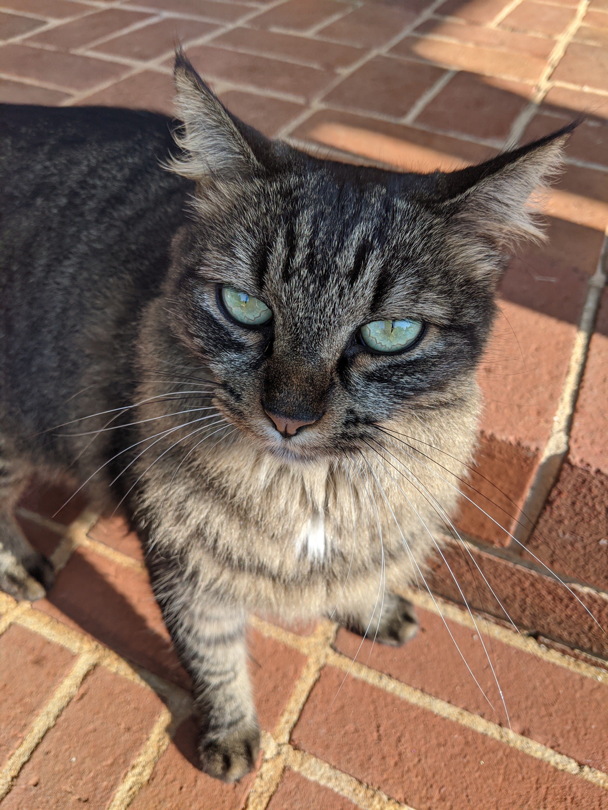

TITLE It's a Cat!

Oh look! It's a cute cat!

Since the cat.jpg file doesn't end in `.md` or `.html`, `didact-template` doesn't try to process it with a template. It's just hard-linked directly to `html/`.

(Incase you're wondering, this is a picture of *my* (the creator of Didact's) cat. Her name is Nith, which is [Spem for grey](https://yujiri.xyz/spem/search?word=nɪθ).)
